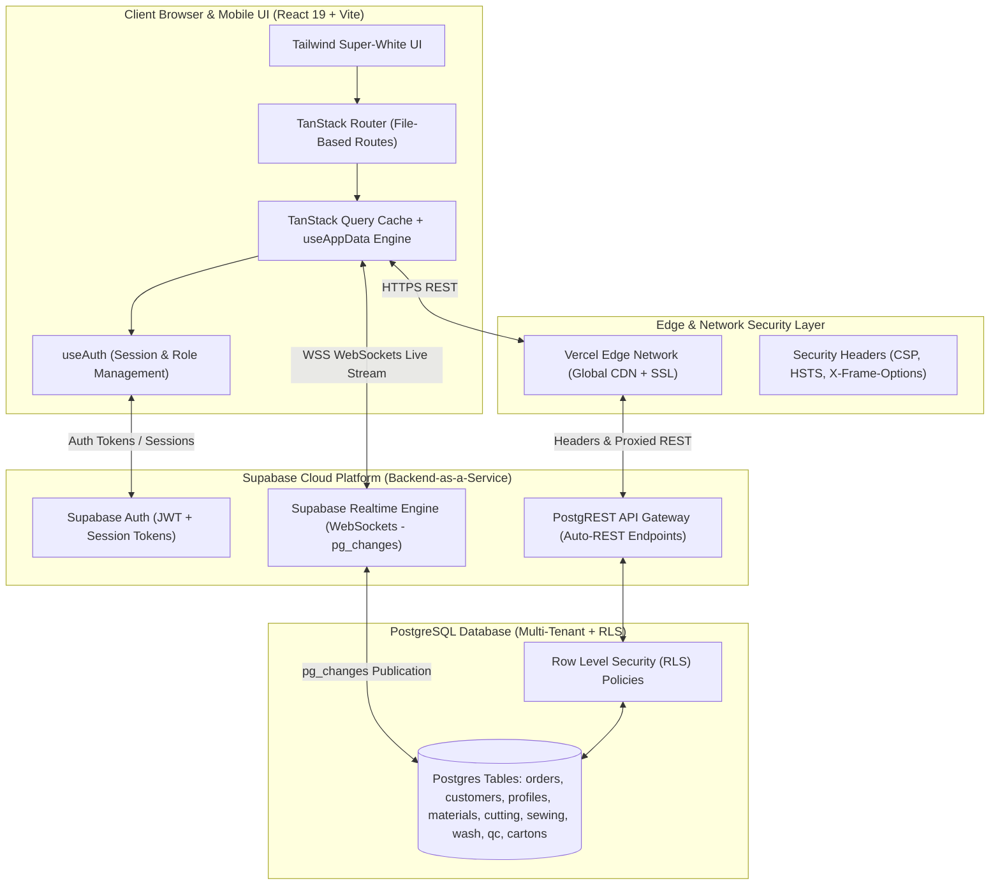
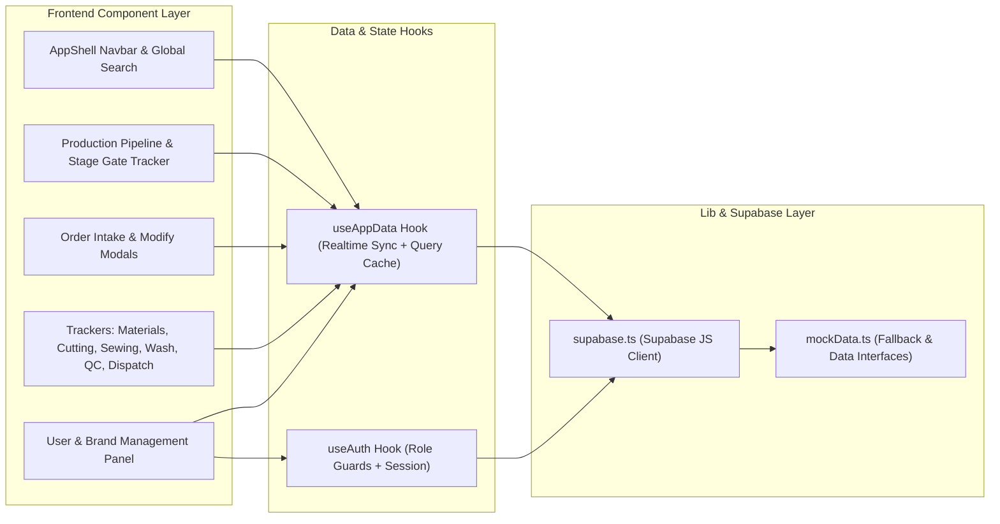
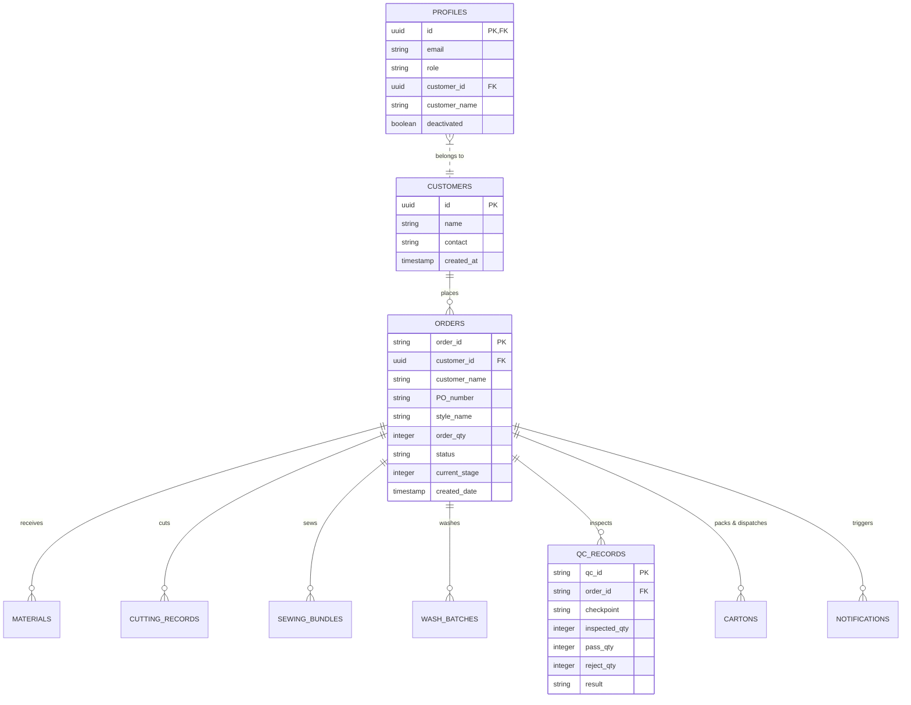
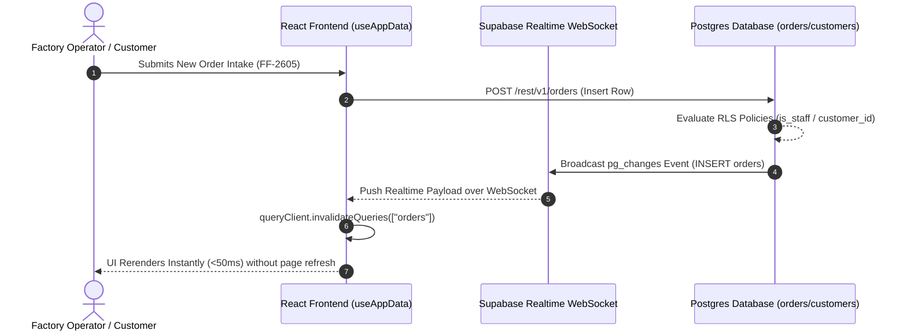
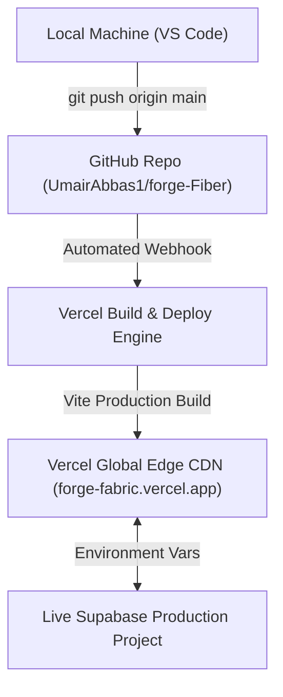

# 🏗️ Architectural Design Document: Forge & Fabric (`forge-Fiber`)

**System:** Industrial Garment Conversion & WIP Production Flow Management Platform  
**Version:** 1.4.0 Production  
**Architecture Pattern:** Client-Side Single Page Application + BaaS Edge Architecture  
**Tech Stack:** React 19, TypeScript, TanStack Start/Router, TanStack Query, Tailwind CSS, Supabase (Postgres / Auth / Realtime), Vercel Edge Network

---

## 1. High-Level System Architecture Diagram

---

## 2. Component & Modular Layer Architecture

---

## 3. Database Schema & Entity-Relationship Diagram (ERD)

---

## 4. Real-Time Data Synchronization & Multi-Layer Scoping Flow

---

## 5. Security & Role-Based Access Control (RBAC) Architecture

| Layer | Security Mechanism | Enforced Rule |
| :--- | :--- | :--- |
| **Network & Transport** | Vercel Edge CDN | HTTPS 256-bit SSL, `X-Frame-Options: DENY`, `HSTS`, `nosniff` |
| **Authentication** | Supabase Auth (JWT) | Password complexity (8+ chars, upper/lower/digit/symbol), Revocable JWTs |
| **Route Protection** | React Route Guards | Unauthenticated users redirected to `/login`; Non-admins redirected from `/settings` |
| **Database Layer** | Postgres RLS Policies | Table-level isolation (`is_staff()` and `get_customer_order_ids()`) |
| **Data Scoping** | Multi-Layer Customer Engine | Customers access **only** orders linked to their own brand ID / email domain |

---

## 6. Deployment & CI/CD Pipeline

---

## 7. Operational & Production Rules
1. **Zero-Downtime Deployments:** All code pushes to the `main` branch trigger automated builds on Vercel.
2. **Zero-Polling Realtime:** Event-driven WebSockets eliminate database load.
3. **Data Integrity Gates:** Production stages (5, 8, 11, 12) strictly enforce approved `QCRecord` verification before stage progression.
